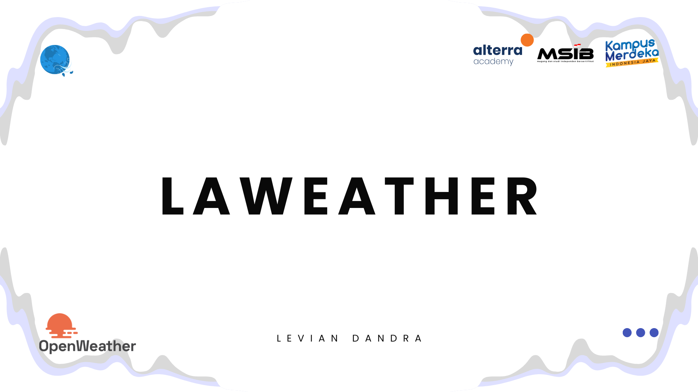
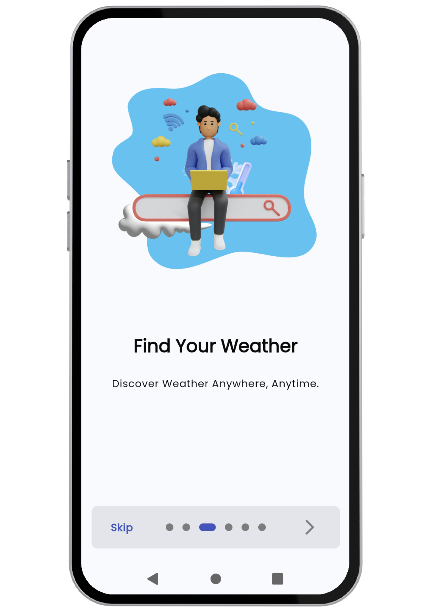

<a name="readme-top"></a>

[![Contributors][contributors-shield]][contributors-url]
[![Forks][forks-shield]][forks-url]
[![Stargazers][stars-shield]][stars-url]
[![Issues][issues-shield]][issues-url]
[![MIT License][license-shield]][license-url]
[![LinkedIn][linkedin-shield]][linkedin-url]


<br />
<div align="center">
  <a href="https://github.com/77leviann/laweather">
    
  </a>

<h3 align="center">Laweather</h3>

  <p align="center">
    Personal Mini Project on <strong>Mobile Engineer With Flutter Alttera Academy - Kampus Merdeka Batch 6</strong>. </p>
    <br />
    <a href="https://github.com/77leviann/laweather"><strong>Explore the docs »</strong></a>
    <br />
    <br />
    <a href="https://github.com/77leviann/laweather">View Demo</a>
    ·
    <a href="https://github.com/77leviann/laweather/issues/new?labels=bug&template=bug-report---.md">Report Bug</a>
    ·
    <a href="https://github.com/77leviann/laweather/issues/new?labels=enhancement&template=feature-request---.md">Request Feature</a>
    <br />
    <br />
  </p>
</div>


<details>
  <summary>Table of Contents</summary>
  <ol>
    <li>
      <a href="#about-the-project">About The Project</a>
      <ul>
        <li><a href="#built-with">Built With</a></li>
      </ul>
    </li>
    <li>
      <a href="#getting-started">Getting Started</a>
      <ul>
        <li><a href="#prerequisites">Prerequisites</a></li>
        <li><a href="#installation">Installation</a></li>
      </ul>
    </li>
    <li><a href="#screenshots">Screenshots</a></li>
    <li><a href="#roadmap">Roadmap</a></li>
    <li><a href="#contributing">Contributing</a></li>
    <li><a href="#license">License</a></li>
    <li><a href="#contact">Contact</a></li>
    <li><a href="#acknowledgments">Acknowledgments</a></li>
  </ol>
</details>


## About The Project



Laweather is an application designed to provide accurate real-time weather information and weather forecasts. Utilizing the     <a href="https://openweathermap.org/"><strong>OpenWeatherMap</strong></a> API, Laweather offers a variety of features that help users plan their daily activities based on the weather conditions in their location.

<p align="right">(<a href="#readme-top">back to top</a>)</p>


### Built With

* [![Dart][Dart]][Dart-url]
* [![Flutter][Flutter]][Flutter-url]

```yaml
dependencies:
  flutter:
    sdk: flutter
  flutter_native_splash: ^2.4.0
  flex_color_scheme: ^7.3.1
  flutter_screenutil: ^5.9.0
  flutter_bloc: ^8.1.5
  equatable: ^2.0.5
  google_fonts: ^6.1.0
  introduction_screen: ^3.1.14
  dots_indicator: ^2.1.2
  shared_preferences: ^2.2.3
  dio: ^5.4.3+1
  envied: ^0.5.4+1
  geolocator: ^11.0.0
  permission_handler: ^11.3.1
  shimmer: ^3.0.0
  country_code_picker: ^3.0.0
  intl: ^0.18.0
  toggle_switch: ^2.3.0
  curved_navigation_bar: ^1.0.3
  provider: ^6.1.2
  flutter_gemini: ^2.0.3
  dash_chat_2: ^0.0.20

dev_dependencies:
  flutter_test:
    sdk: flutter
  flutter_lints: ^3.0.0
  envied_generator: ^0.5.4+1
  build_runner: ^2.4.9
```

<p align="right">(<a href="#readme-top">back to top</a>)</p>


## Getting Started

This guide will walk you through setting up your project locally. Follow these steps to get started.

### Prerequisites

Before you begin, ensure you have the following installed:
- [Flutter](https://flutter.dev/)
- [Dart](https://dart.dev/)

If you haven't installed Flutter yet, you can do so by following the instructions [here](https://flutter.dev/docs/get-started/install).

### Installation

1. Acquire an API Key from [OpenWeatherMap](https://openweathermap.org/) by signing up for a developer account and selecting the appropriate plan. After that acquire API Key from [Gemini](https://aistudio.google.com/) for chatbot feature.

2. Clone the repository:
   ```sh
   git clone https://github.com/77leviann/laweather.git
   ```
3. Navigate to the project directory:
   ```sh
   cd laweather
   ```
4. Create a file named .env in the root directory of your project. Use the .env.example file as a template for the required environment variables.   
5. Run the following command in your terminal to get the necessary dependencies:
   ```sh
   flutter pub get
   ```
6. Execute the following command in your to generate env.g.dart files:
   ```sh
   flutter pub run build_runner build
   ```
7. Run project.

<p align="right">(<a href="#readme-top">back to top</a>)</p>


## Screenshots

Below are some screenshots that demonstrate the usage of the project:

<div style="display: flex; flex-wrap: wrap; gap: 20px; justify-content: center;">

  <div style="width: 30%; text-align: center; border: 1px solid #ddd; padding: 10px; box-sizing: border-box;">
    <p>Splash Light Mode</p>
    
  </div>

  <div style="width: 30%; text-align: center; border: 1px solid #ddd; padding: 10px; box-sizing: border-box;">
    <p>Splash Dark Mode</p>
    
  </div>

  <div style="width: 30%; text-align: center; border: 1px solid #ddd; padding: 10px; box-sizing: border-box;">
    <p>On Boarding Page 1</p>
    
  </div>

  <div style="width: 30%; text-align: center; border: 1px solid #ddd; padding: 10px; box-sizing: border-box;">
    <p>On Boarding Page 2</p>
    
  </div>

  <div style="width: 30%; text-align: center; border: 1px solid #ddd; padding: 10px; box-sizing: border-box;">
    <p>On Boarding Page 3</p>
    
  </div>

  <div style="width: 30%; text-align: center; border: 1px solid #ddd; padding: 10px; box-sizing: border-box;">
    <p>On Boarding Page 4</p>
    
  </div>

  <div style="width: 30%; text-align: center; border: 1px solid #ddd; padding: 10px; box-sizing: border-box;">
    <p>On Boarding Page 5</p>
    
  </div>

  <div style="width: 30%; text-align: center; border: 1px solid #ddd; padding: 10px; box-sizing: border-box;">
    <p>On Boarding Page 6</p>
    
  </div>

  <div style="width: 30%; text-align: center; border: 1px solid #ddd; padding: 10px; box-sizing: border-box;">
    <p>Home Screen</p>
    
  </div>

  <div style="width: 30%; text-align: center; border: 1px solid #ddd; padding: 10px; box-sizing: border-box;">
    <p>Home Screen 2</p>
    
  </div>

  <div style="width: 30%; text-align: center; border: 1px solid #ddd; padding: 10px; box-sizing: border-box;">
    <p>Detail Screen</p>
    
  </div>

  <div style="width: 30%; text-align: center; border: 1px solid #ddd; padding: 10px; box-sizing: border-box;">
    <p>Search Screen</p>
    
  </div>

  <div style="width: 30%; text-align: center; border: 1px solid #ddd; padding: 10px; box-sizing: border-box;">
    <p>Search Screen 2</p>
    
  </div>

  <div style="width: 30%; text-align: center; border: 1px solid #ddd; padding: 10px; box-sizing: border-box;">
    <p>Chatbot Screen</p>
    
  </div>

  <div style="width: 30%; text-align: center; border: 1px solid #ddd; padding: 10px; box-sizing: border-box;">
    <p>Chatbot Screen 2</p>
    
  </div>

</div>


<p align="right">(<a href="#readme-top">back to top</a>)</p>


## Roadmap

- [ ] Splash
- [ ] On Boarding
- [ ] Home
- [ ] Detail
- [ ] Search
- [ ] Chatbot

See the [open issues](https://github.com/77leviann/laweather/issues) for a full list of proposed features (and known issues).

<p align="right">(<a href="#readme-top">back to top</a>)</p>


## Contributing

Contributions are what make the open source community such an amazing place to learn, inspire, and create. Any contributions you make are *greatly appreciated*.

If you have a suggestion that would make this better, please fork the repo and create a pull request. You can also simply open an issue with the tag "enhancement".
Don't forget to give the project a star! Thanks again!

1. Fork the Project
2. Create your Feature Branch (git checkout -b feature/AmazingFeature)
3. Commit your Changes (git commit -m 'Add some AmazingFeature')
4. Push to the Branch (git push origin feature/AmazingFeature)
5. Open a Pull Request

<p align="right">(<a href="#readme-top">back to top</a>)</p>


## License

Distributed under the MIT License. See LICENSE.txt for more information.

<p align="right">(<a href="#readme-top">back to top</a>)</p>


## Contact

Levian Dandra - 77leviann@gmail.com

Project Link: [https://github.com/77leviann/laweather](https://github.com/77leviann/laweather)

<p align="right">(<a href="#readme-top">back to top</a>)</p>


## Acknowledgments

I would like to express my gratitude to the following individuals and organizations for their support and contributions to this project:

- **Raka Fajar S** - My mentor, for his invaluable guidance and support. You can find his work on [GitHub](https://github.com/rakafajars).
- **OpenWeatherMap** - For providing the weather API. The Developer plan for current weather and forecasts, as well as the Medium plan for historical weather collection, are free for students and educators.
- **Gemini** - For providing a free API.
- **Open Source Libraries** - For the libraries and tools that made development easier and more efficient.
- **othneildrew** - For creating the [Best-README-Template](https://github.com/othneildrew/Best-README-Template), which inspired and assisted in the creation of this README.

Thank you all for your invaluable contributions!


<p align="right">(<a href="#readme-top">back to top</a>)</p>


[contributors-shield]: https://img.shields.io/github/contributors/77leviann/laweather.svg?style=for-the-badge
[contributors-url]: https://github.com/77leviann/laweather/graphs/contributors
[forks-shield]: https://img.shields.io/github/forks/77leviann/laweather.svg?style=for-the-badge
[forks-url]: https://github.com/77leviann/laweather/network/members
[stars-shield]: https://img.shields.io/github/stars/77leviann/laweather.svg?style=for-the-badge
[stars-url]: https://github.com/77leviann/laweather/stargazers
[issues-shield]: https://img.shields.io/github/issues/77leviann/laweather.svg?style=for-the-badge
[issues-url]: https://github.com/77leviann/laweather/issues
[license-shield]: https://img.shields.io/github/license/77leviann/laweather.svg?style=for-the-badge
[license-url]: https://github.com/77leviann/laweather/blob/master/LICENSE.txt
[linkedin-shield]: https://img.shields.io/badge/-LinkedIn-black.svg?style=for-the-badge&logo=linkedin&colorB=555
[linkedin-url]: https://linkedin.com/in/77leviann
[product-screenshot]: (images/screenshot/main_screenshot.png)


[Dart]: https://img.shields.io/badge/Dart-0175C2?style=for-the-badge&logo=dart&logoColor=61DAFB
[Dart-url]: https://dart.dev/
[Flutter]: https://img.shields.io/badge/Flutter-02569B?style=for-the-badge&logo=flutter&logoColor=white
[Flutter-url]: https://flutter.dev/